# School Hub - Architecture Diagrams Guide

This document explains the architecture, API structure, and key flows of the School Hub application using the Mermaid diagrams above.

## 1. System Architecture Overview

**Purpose**: Shows the high-level structure of the application.

**Key Components**:
- **Frontend (Browser)**: Reflex UI components rendered in the browser
- **Backend (Python/Reflex State)**: Server-side state management with AppState
- **Services Layer**: MockMonitoringService (current) + future scrapers
- **Data Models**: Pydantic DTOs for structured data
- **External Systems**: Librus/Vulcan portals (Sprint 6)

**Key Insights**:
- Currently using MockMonitoringService for testing
- Future scrapers will replace mock with real data
- No database - all data in memory (_kids_data)
- Clean separation: UI → State → Services → DTOs

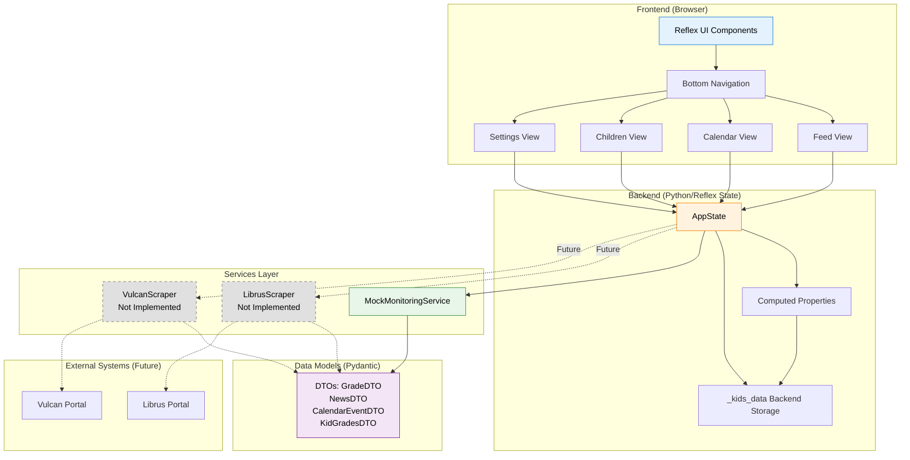

## 2. Data Model Structure

**Purpose**: Shows the relationship between DTOs (Data Transfer Objects).

**Key Relationships**:
- `KidGradesDTO` is the root container per child
- Each kid has multiple `SubjectDTO` records
- Each subject has multiple `PeriodDTO` records (e.g., "OKRES 1")
- Each period has multiple `GradeDTO` records
- `NewsDTO` is stored separately at the kid level

**Key Design Decisions**:
- **Denormalization**: GradeDTO includes `kid_name` and `subject_name` for easy dashboard rendering
- **Sort Keys**: Integer fields (YYYYMMDD) for cross-provider sorting
- **Flat Structure**: NewsDTO and CalendarEventDTO are denormalized for unified feeds

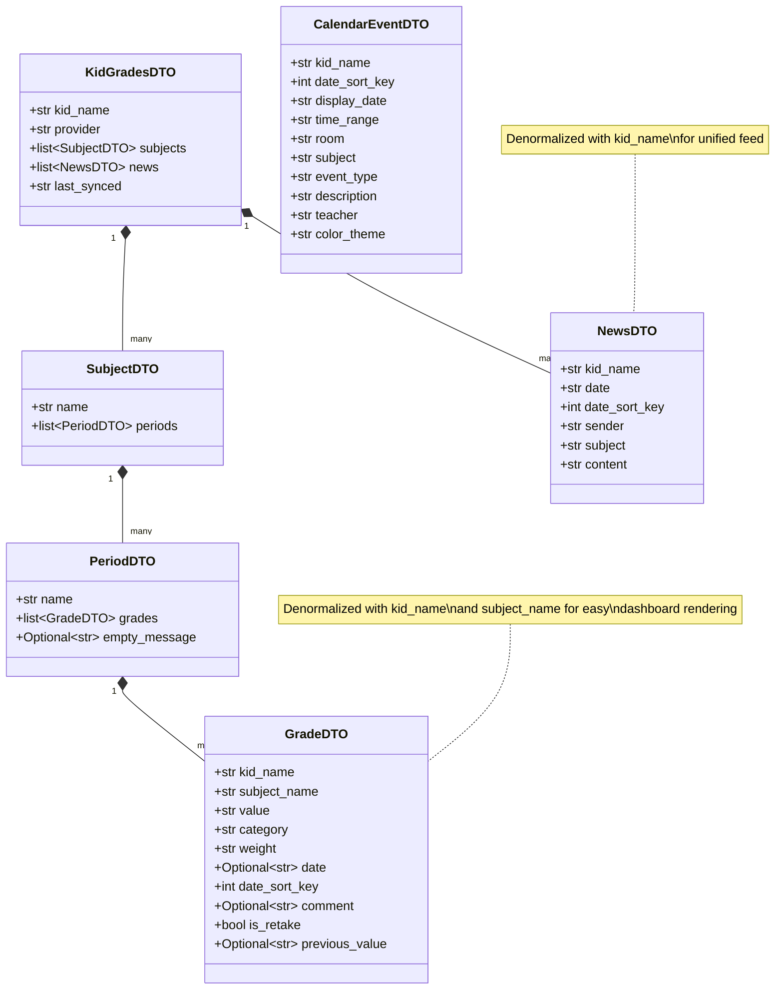

## 3. AppState API Structure

**Purpose**: Explains the Reflex State pattern and available APIs.

**State Categories**:
1. **UI State** (sent to frontend):
   - `current_tab`: Which view is active
   - `last_synced`: Timestamp of last data refresh

2. **Backend Storage** (stays on server):
   - `_kids_data`: List of KidGradesDTO objects (prefix `_` means backend-only)

3. **Computed Properties** (`@rx.var` decorator):
   - `get_sorted_feed`: Merges and sorts all grades/news
   - `get_quick_stats`: Summarizes data per kid

4. **Event Handlers**:
   - `set_current_tab(tab)`: Changes active view
   - `refresh_data()`: Reloads data from service

**Key Pattern**: Backend-only variables use `_` prefix to avoid WebSocket serialization overhead.

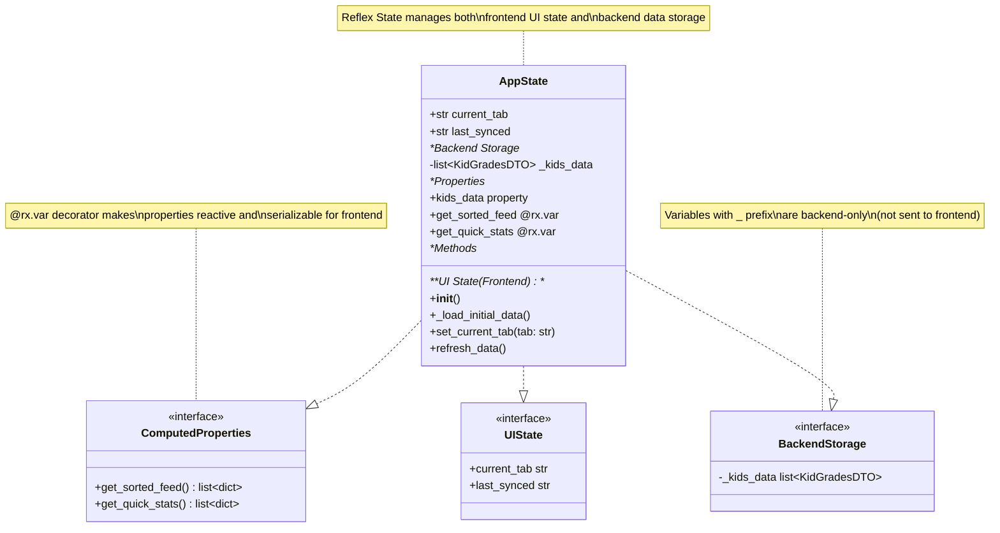

## 4. Component Hierarchy

**Purpose**: Shows how UI components are structured and connected.

**Component Tree**:
```
app.py
└── index()
    ├── render_current_view()
    │   ├── feed_view() [active based on current_tab]
    │   │   ├── quick_stat_card (×4, via rx.foreach)
    │   │   └── feed_card (×many, via rx.foreach)
    │   ├── calendar_view()
    │   ├── children_view()
    │   └── settings_view()
    └── bottom_navigation()
        └── bottom_nav_item (×4)
```

**Key Patterns**:
- `rx.cond()` for conditional rendering (not Python if/else)
- `rx.foreach()` for list rendering
- Event handlers connect UI to State methods

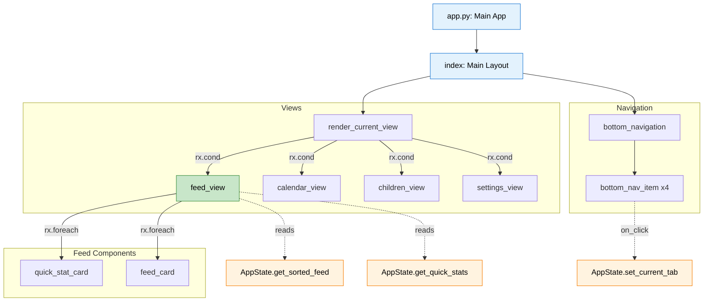

## 5-8. Sequence Diagrams

### 5. Application Initialization
Shows the startup flow: Browser loads → AppState.__init__() → MockService → DTOs → Computed properties → Render

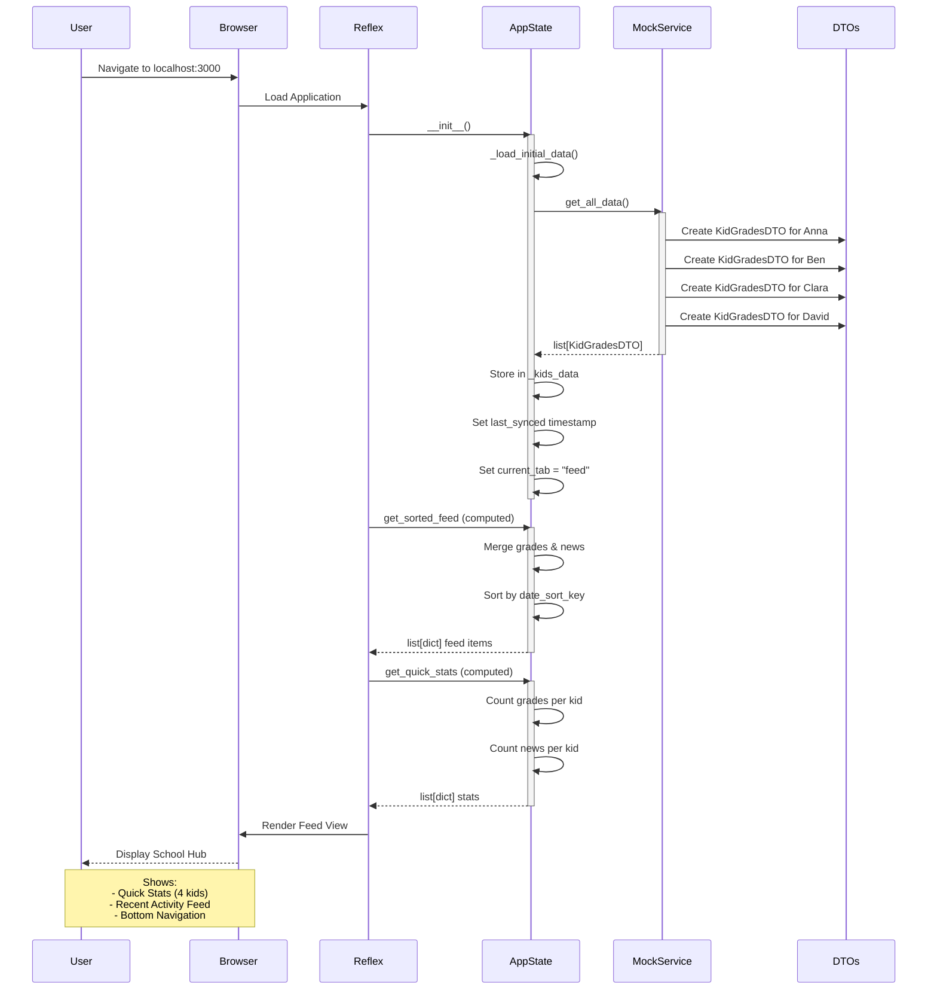

### 6. User Changes Tab
Shows reactive navigation: Click tab → set_current_tab() → State update via WebSocket → Re-render → View changes
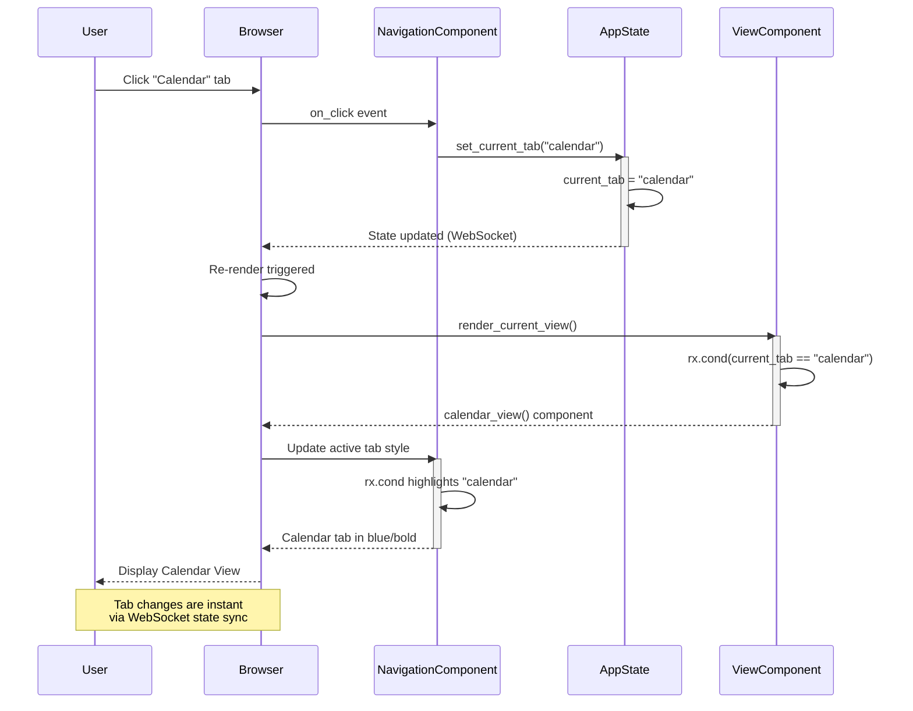

### 7. User Refreshes Data
Shows data refresh flow: Click refresh → refresh_data() → MockService → Update state → Recompute feeds → Re-render
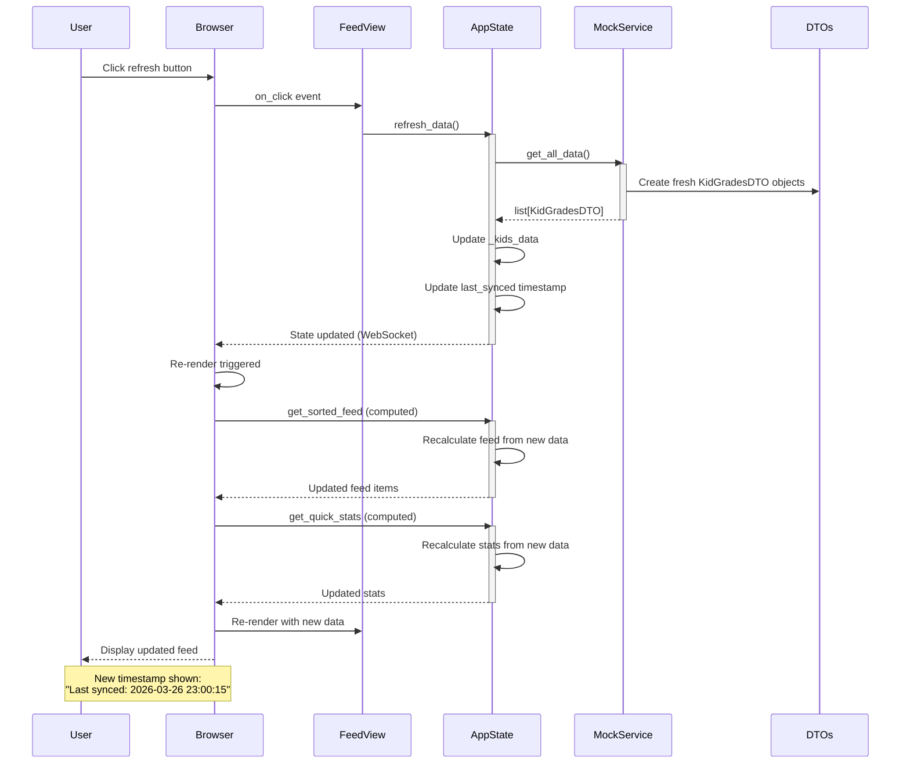

### 8. Feed Rendering Details
Shows how the feed view assembles: get_quick_stats → rx.foreach → get_sorted_feed → rx.foreach → Conditional rendering for grades vs news

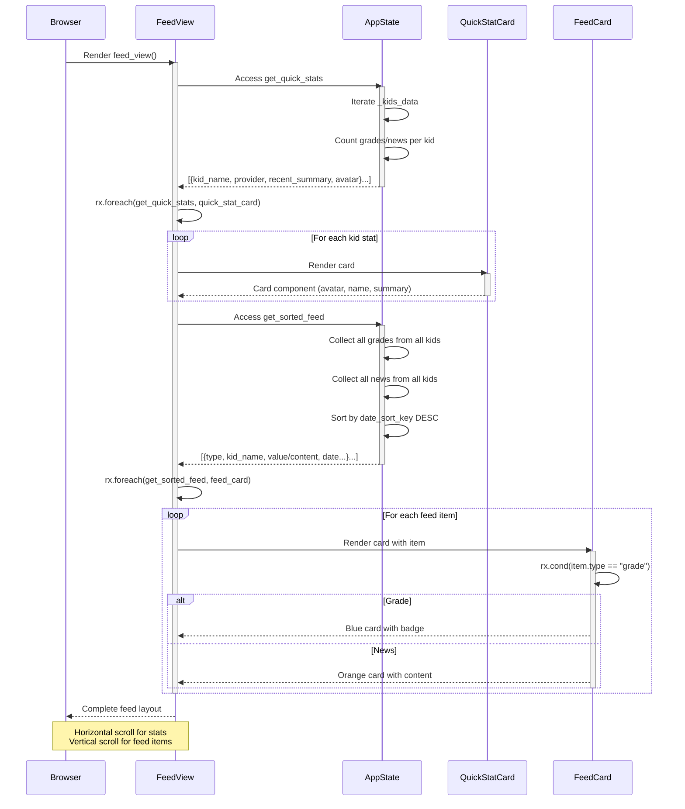

## 9. Future Data Flow (Sprint 6)

**Purpose**: Shows how real scraping will work.

**Flow**:
1. User triggers refresh
2. MonitoringService loads credentials for 4 kids
3. **Parallel scraping**: LibrusScraper and VulcanScraper fetch data simultaneously
4. Each scraper:
   - Logs in to the portal
   - Fetches HTML
   - Parses with BeautifulSoup
   - Normalizes dates to `date_sort_key`
   - Creates DTOs
5. All data merged back to AppState

**Key Design**: Scrapers act as adapters, normalizing different provider formats into unified DTOs.

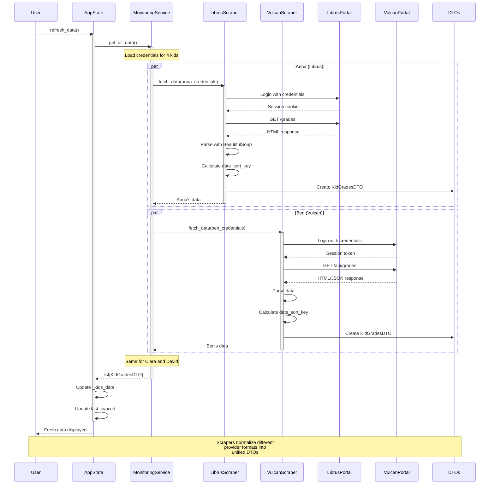

## 10. State Management Pattern

**Purpose**: Explains Reflex's WebSocket-based reactive state.

**How It Works**:
1. **User Action** → WebSocket event sent to backend
2. **Event Handler** updates state variables
3. **State Changes** trigger serialization
4. **WebSocket** sends only changed data to frontend
5. **Frontend** re-renders affected components

**Key Rules**:
- ✅ Public variables (no `_`) are sent to frontend
- ❌ Private variables (`_` prefix) stay on backend
- ✅ `@rx.var` properties are computed and serialized
- ✅ Only changed state is sent (efficient)

```mermaid
graph TB
    subgraph "Frontend (Browser)"
        UI[UI Components]
        WS_CLIENT[WebSocket Client]
    end

    subgraph "Backend (Python Server)"
        WS_SERVER[WebSocket Server]
        STATE[AppState Instance]

        subgraph "State Variables"
            UI_STATE[current_tab<br/>last_synced<br/>PUBLIC]
            BACKEND_STATE[_kids_data<br/>PRIVATE]
        end

        subgraph "Computed Properties"
            COMP1[@rx.var<br/>get_sorted_feed]
            COMP2[@rx.var<br/>get_quick_stats]
        end

        subgraph "Event Handlers"
            HANDLER1[set_current_tab]
            HANDLER2[refresh_data]
        end
    end

    UI -->|User Action| WS_CLIENT
    WS_CLIENT -->|Event| WS_SERVER
    WS_SERVER --> HANDLER1
    WS_SERVER --> HANDLER2

    HANDLER1 --> UI_STATE
    HANDLER2 --> BACKEND_STATE
    HANDLER2 --> UI_STATE

    STATE --> UI_STATE
    STATE --> BACKEND_STATE
    STATE --> COMP1
    STATE --> COMP2

    COMP1 --> BACKEND_STATE
    COMP2 --> BACKEND_STATE

    UI_STATE -->|Serialized| WS_SERVER
    COMP1 -->|Serialized| WS_SERVER
    COMP2 -->|Serialized| WS_SERVER
    BACKEND_STATE -.NOT sent.-> WS_SERVER

    WS_SERVER -->|State Update| WS_CLIENT
    WS_CLIENT -->|Re-render| UI

    style UI_STATE fill:#c8e6c9,stroke:#388e3c,color:#000
    style BACKEND_STATE fill:#ffcdd2,stroke:#c62828,color:#000
    style COMP1 fill:#fff9c4,stroke:#f57f17,color:#000
    style COMP2 fill:#fff9c4,stroke:#f57f17,color:#000
    style WS_CLIENT fill:#e3f2fd,stroke:#1976d2,color:#000
    style WS_SERVER fill:#e3f2fd,stroke:#1976d2,color:#000

```
---

## 11. Settings View - Add New Student Flow

**Purpose**: Detailed specification for adding a new student profile with credentials.

**User Story**: As a parent, I want to add a new student profile so that I can monitor their school data from Librus or Vulcan.

**Flow**:
1. User clicks "Add New Student" button in Settings view
2. Dialog opens with empty form
3. User fills in: Student Name, Provider (radio: Librus/Vulcan), Login, Password
4. User clicks "Save Profile"
5. System validates input (all fields required)
6. System encrypts and saves credentials to `credentials.json`
7. Dialog closes
8. Profile card appears in the list

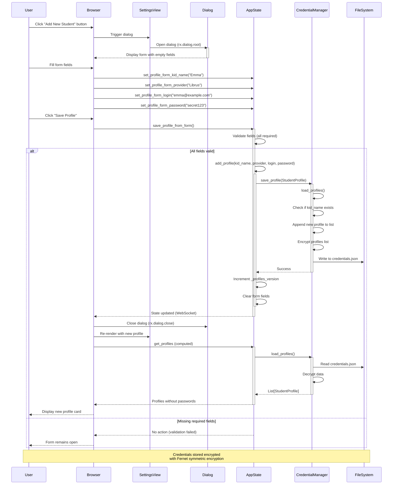

**Validation Rules**:
- `kid_name`: Required, non-empty string
- `provider`: Required, must be "Librus" or "Vulcan"
- `login`: Required, non-empty string
- `password`: Required, non-empty string

**Security Considerations**:
- Passwords encrypted with Fernet before storage
- Encryption key stored in `.encryption.key` file
- `get_profiles` computed var NEVER returns passwords to frontend
- Form state cleared immediately after save

**UI Components**:
```python
# Dialog structure (already implemented in views.py)
rx.dialog.root(
    rx.dialog.trigger(rx.button("Add New Student")),
    rx.dialog.content(
        rx.dialog.title("Add New Student"),
        rx.vstack(
            rx.input(on_change=AppState.set_profile_form_kid_name),
            rx.radio(["Librus", "Vulcan"], on_change=AppState.set_profile_form_provider),
            rx.input(on_change=AppState.set_profile_form_login),
            rx.input(type="password", on_change=AppState.set_profile_form_password),
        ),
        rx.button("Save Profile", on_click=AppState.save_profile_from_form),
    )
)
```

---

## 12. Settings View - Edit Student Profile Flow

**Purpose**: Detailed specification for editing an existing student profile.

**User Story**: As a parent, I want to edit a student's credentials when they change their password or if I made a typo.

**Current Status**: ⚠️ **INCOMPLETE** - `open_edit_profile_dialog` is a placeholder

**Required Implementation**:

### 12.1 State Variables (Add to AppState)
```python
# Edit mode tracking
profile_edit_mode: bool = False
profile_edit_kid_name: str = ""  # Original kid_name being edited
```

### 12.2 Event Handlers (Update in AppState)

```python
def open_edit_profile_dialog(self, kid_name: str):
    """Open the edit dialog and populate form with existing profile data.

    Args:
        kid_name: Name of the student whose profile should be edited
    """
    # Load existing profile
    profile = self._credential_manager.get_profile(kid_name)

    if profile:
        # Populate form with existing data
        self.profile_form_kid_name = profile.kid_name
        self.profile_form_provider = profile.provider
        self.profile_form_login = profile.login
        self.profile_form_password = profile.password  # Pre-fill for editing

        # Set edit mode
        self.profile_edit_mode = True
        self.profile_edit_kid_name = kid_name

def save_profile_from_form(self):
    """Save the profile from the form data (handles both add and edit)."""
    if (
        self.profile_form_kid_name
        and self.profile_form_login
        and self.profile_form_password
    ):
        if self.profile_edit_mode:
            # Edit mode: update existing profile
            self.update_profile(
                kid_name=self.profile_form_kid_name,
                provider=self.profile_form_provider,
                login=self.profile_form_login,
                password=self.profile_form_password,
            )
        else:
            # Add mode: create new profile
            self.add_profile(
                kid_name=self.profile_form_kid_name,
                provider=self.profile_form_provider,
                login=self.profile_form_login,
                password=self.profile_form_password,
            )

        # Clear form and reset edit mode
        self.profile_form_kid_name = ""
        self.profile_form_provider = "Librus"
        self.profile_form_login = ""
        self.profile_form_password = ""
        self.profile_edit_mode = False
        self.profile_edit_kid_name = ""

def cancel_profile_form(self):
    """Cancel the form and reset all state."""
    self.profile_form_kid_name = ""
    self.profile_form_provider = "Librus"
    self.profile_form_login = ""
    self.profile_form_password = ""
    self.profile_edit_mode = False
    self.profile_edit_kid_name = ""
```

### 12.3 UI Component Updates (Update in views.py)

```python
def add_profile_dialog() -> rx.Component:
    """Dialog for adding/editing a student profile."""
    return rx.dialog.root(
        rx.dialog.trigger(
            rx.button(
                rx.icon("plus", size=18),
                " Add New Student",
                size="3",
                color_scheme="blue",
            ),
        ),
        rx.dialog.content(
            # Dynamic title based on edit mode
            rx.cond(
                AppState.profile_edit_mode,
                rx.dialog.title("Edit Student Profile"),
                rx.dialog.title("Add New Student"),
            ),
            rx.dialog.description(
                "Enter the student's information and provider credentials.",
                size="2",
                margin_bottom="1rem",
            ),
            rx.vstack(
                # Student Name
                rx.vstack(
                    rx.text("Student Name", size="2", weight="bold"),
                    rx.input(
                        placeholder="e.g., Anna",
                        value=AppState.profile_form_kid_name,
                        on_change=AppState.set_profile_form_kid_name,
                        size="3",
                    ),
                    spacing="1",
                    width="100%",
                    align_items="start",
                ),
                # Provider Selection
                rx.vstack(
                    rx.text("School Provider", size="2", weight="bold"),
                    rx.radio(
                        ["Librus", "Vulcan"],
                        value=AppState.profile_form_provider,
                        on_change=AppState.set_profile_form_provider,
                        size="2",
                    ),
                    spacing="1",
                    width="100%",
                    align_items="start",
                ),
                # Login
                rx.vstack(
                    rx.text("Login", size="2", weight="bold"),
                    rx.input(
                        placeholder="username or email",
                        value=AppState.profile_form_login,
                        on_change=AppState.set_profile_form_login,
                        size="3",
                    ),
                    spacing="1",
                    width="100%",
                    align_items="start",
                ),
                # Password
                rx.vstack(
                    rx.text("Password", size="2", weight="bold"),
                    rx.input(
                        type="password",
                        placeholder="••••••••",
                        value=AppState.profile_form_password,
                        on_change=AppState.set_profile_form_password,
                        size="3",
                    ),
                    spacing="1",
                    width="100%",
                    align_items="start",
                ),
                spacing="4",
                width="100%",
            ),
            rx.flex(
                rx.dialog.close(
                    rx.button(
                        "Cancel",
                        on_click=AppState.cancel_profile_form,
                        variant="soft",
                        color_scheme="gray",
                    ),
                ),
                rx.dialog.close(
                    rx.button(
                        # Dynamic button text
                        rx.cond(
                            AppState.profile_edit_mode,
                            "Update Profile",
                            "Save Profile",
                        ),
                        on_click=AppState.save_profile_from_form,
                        color_scheme="blue",
                    ),
                ),
                spacing="3",
                margin_top="1rem",
                justify="end",
            ),
            max_width="450px",
        ),
        # Control dialog open state programmatically
        open=AppState.profile_edit_mode | (AppState.profile_form_kid_name != ""),
    )
```

### 12.4 Edit Flow Sequence Diagram

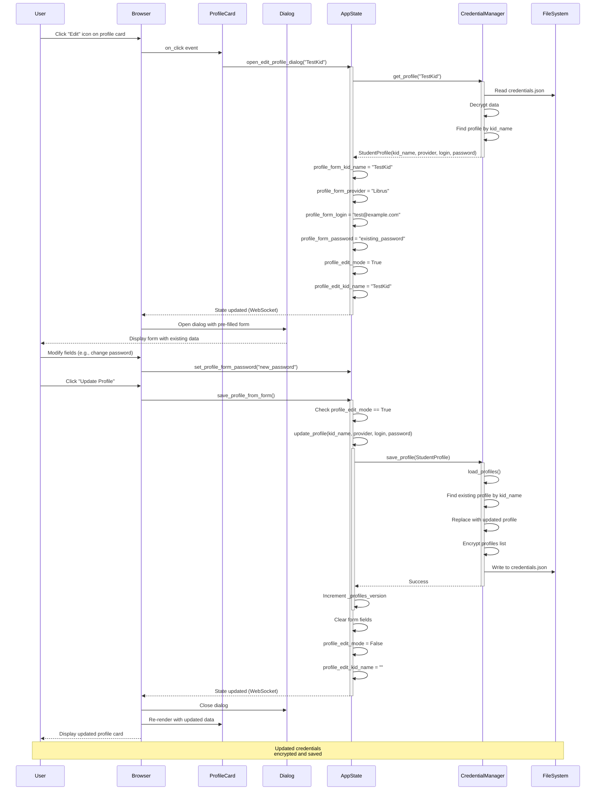

### 12.5 Key Differences: Add vs Edit

| Aspect | Add Mode | Edit Mode |
|--------|----------|-----------|
| Dialog Title | "Add New Student" | "Edit Student Profile" |
| Button Text | "Save Profile" | "Update Profile" |
| Form Pre-fill | Empty fields | Populated with existing data |
| State Flag | `profile_edit_mode = False` | `profile_edit_mode = True` |
| Operation | `add_profile()` | `update_profile()` |
| Validation | Check for duplicate kid_name | Allow same kid_name (updating) |

### 12.6 Edge Cases to Handle

1. **User clicks Edit but profile no longer exists**: Show error message or silently fail
2. **User changes kid_name during edit**: This changes the profile identity - should be prevented or handled carefully
3. **User clicks Cancel**: Clear form and reset `profile_edit_mode`
4. **Multiple rapid clicks on Edit**: Debounce or disable button during operation

---

## 13. Settings View - Delete Profile Flow

**Purpose**: Specification for deleting a student profile (already implemented).

**User Story**: As a parent, I want to remove a student profile when they graduate or change schools.

**Current Implementation**: ✅ **COMPLETE** in `AppState.delete_profile()`

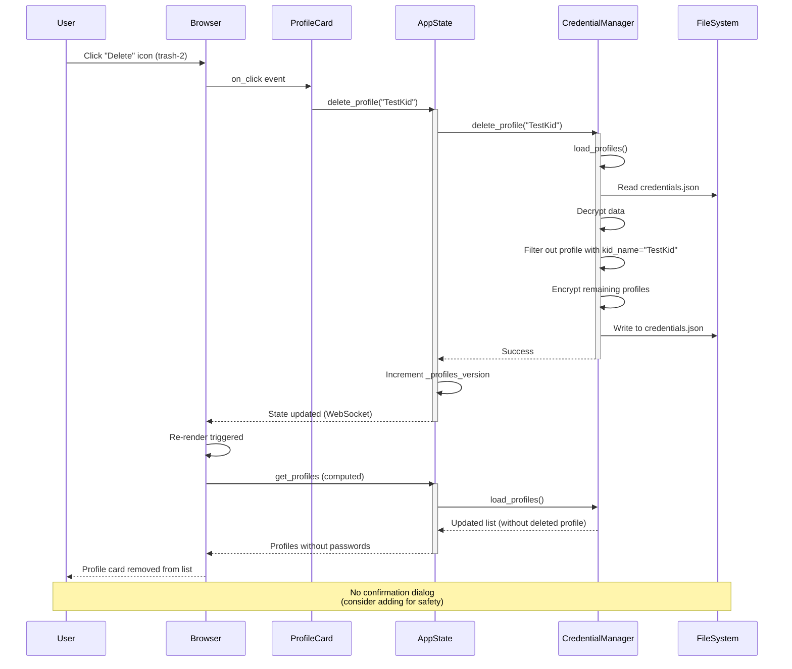

**Potential Enhancement**: Add confirmation dialog before deletion
```python
# Future improvement
def confirm_delete_profile(self, kid_name: str):
    """Show confirmation dialog before deleting."""
    self.delete_confirm_kid_name = kid_name
    self.delete_confirm_open = True

def execute_delete_profile(self):
    """Execute the deletion after confirmation."""
    if self.delete_confirm_kid_name:
        self.delete_profile(self.delete_confirm_kid_name)
        self.delete_confirm_kid_name = ""
        self.delete_confirm_open = False
```

---

## Quick Reference

| Component | Purpose | Location |
|-----------|---------|----------|
| `models.py` | DTOs (Pydantic) | Data structure |
| `state.py` | AppState | State management |
| `services/mock_service.py` | Mock data generator | Service layer |
| `services/credential_manager.py` | Encrypted credential storage | Service layer |
| `components/navigation.py` | Bottom nav bar | UI component |
| `components/views.py` | View components | UI component |
| `school_hub.py` | Main app | Entry point |

## Key Architectural Principles

1. **No Database**: All data in memory (Reflex State)
2. **Thin Client**: Browser only renders, no business logic
3. **Denormalization**: DTOs include parent context for easy rendering
4. **Reactive UI**: WebSocket-based state synchronization
5. **TDD**: Tests before implementation for all features
6. **Clean Separation**: UI → State → Services → DTOs

7. **Security**: Credentials encrypted with Fernet, never sent to frontend
