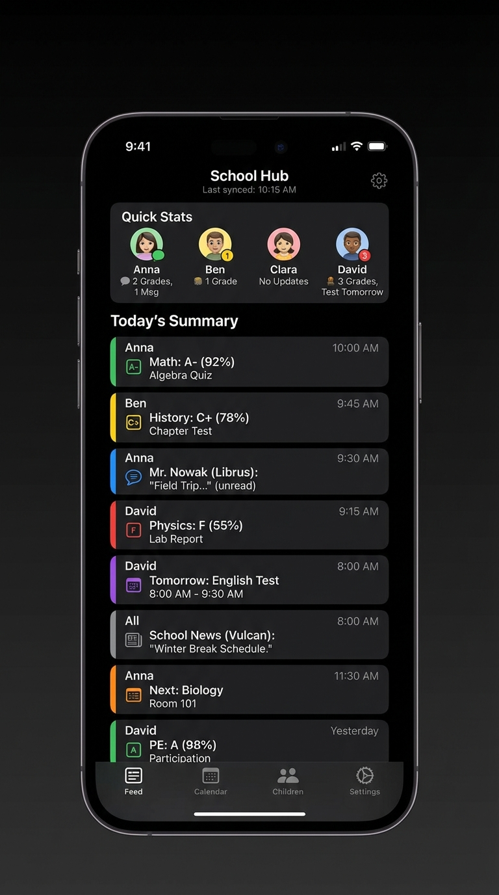
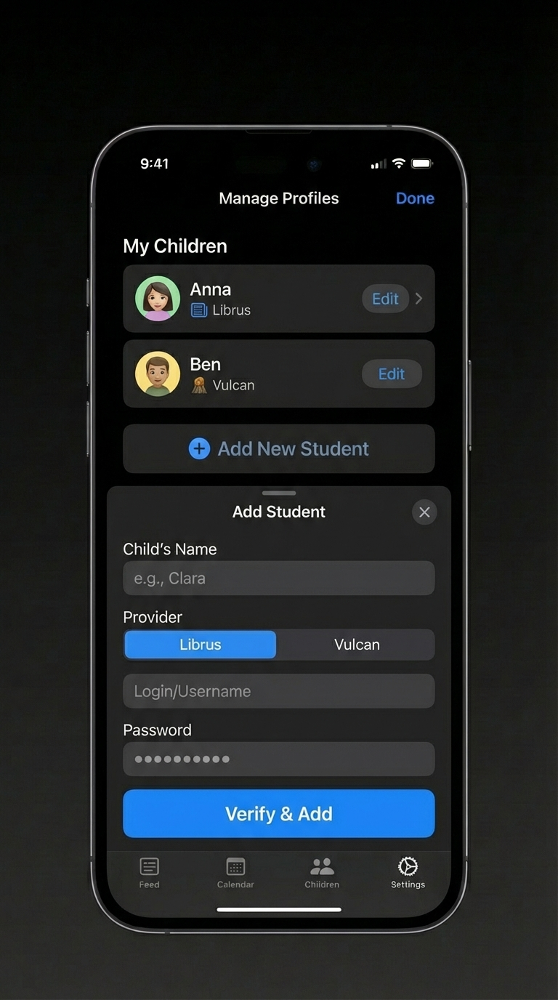
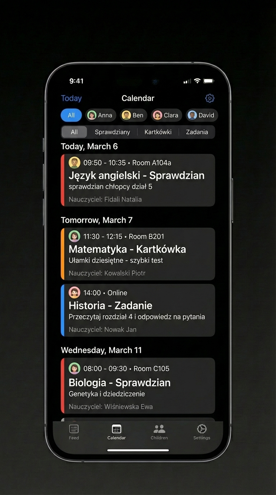

# Unified School Monitoring Platform - Technical Specification

## Chapter 1: Domain Understanding & Data Model

**Context:** A locally hosted, unified dashboard built with the Reflex framework to aggregate school data for a family with 4 children across two providers (Librus and Vulcan). 
**Core Constraint:** This is a **Read-Only Thin Client**. It scrapes HTML, extracts strings "as is", and holds them in memory. There is **NO Database** (no SQL, no ORM). 

### 1.1 Ubiquitous Language
*   **Provider:** The external school system (Librus or Vulcan).
*   **Student Profile:** A local representation of a child and their associated Provider credentials.
*   **Scraper Adapter:** The Python class responsible for logging in, fetching HTML, and parsing it into DTOs.
*   **DTO (Data Transfer Object):** In-memory Python objects (`rx.Base`) that hold the scraped strings.
*   **Retake (Poprawa):** A specific grade type that contains two values and two dates, parsed from a single string.
*   **Denormalization:** Storing parent context (like `kid_name` and `subject_name`) directly inside child objects (like `GradeDTO`) so they can be rendered independently on a unified dashboard.

### 1.2 Core Data Models (Reflex State DTOs)
The LLM must use these exact structures. They are designed specifically for Reflex UI rendering without complex business logic. All display values are treated as strings. Hidden `sort_key` fields are used to normalize sorting across different Provider date formats.

```python
import reflex as rx
from typing import List, Optional

class GradeDTO(rx.Base):
    """Represents a single grade or a retake. Denormalized for easy dashboard rendering."""
    # --- CONTEXT (Denormalized relations for the Unified Dashboard) ---
    kid_name: str                   # e.g., "Janek"
    subject_name: str               # e.g., "Historia"

    # --- DISPLAY FIELDS (Strings "As Is" for the UI) ---
    value: str                      # e.g., "4", "+", or "5" (if retake)
    category: str                   # e.g., "karty pracy (S)"
    weight: str                     # e.g., "3", "brak"
    date: Optional[str] = None      # e.g., "2025-09-24 (śr.)"
    comment: Optional[str] = None   # e.g., "Historia-nauka o przeszłości..."
    
    # --- SORTING FIELDS (Hidden from UI, used only for logic) ---
    # Scrapers must convert Provider-specific date strings into a standard integer (YYYYMMDD)
    date_sort_key: int = 0          # e.g., 20250924 (Allows sorting newest to oldest)
    
    # --- RETAKE SPECIFIC FIELDS ---
    is_retake: bool = False
    previous_value: Optional[str] = None  # e.g., "1+"
    original_date: Optional[str] = None   # e.g., "2025-12-02 (wt.)"
    retake_date: Optional[str] = None     # e.g., "2025-12-15 (pon.)"

class PeriodDTO(rx.Base):
    name: str                       # e.g., "OKRES 1"
    grades: List[GradeDTO]
    empty_message: Optional[str] = None # e.g., "Brak ocen."

class SubjectDTO(rx.Base):
    name: str                       # e.g., "Historia"
    periods: List[PeriodDTO]

class NewsDTO(rx.Base):
    """Represents a school announcement/message. Denormalized for dashboard."""
    kid_name: str                   # e.g., "Zosia"
    date: str                       # e.g., "2025-10-01 14:30"
    date_sort_key: int = 0          # e.g., 202510011430 (YYYYMMDDHHMM)
    sender: str
    subject: str
    content: str

class KidGradesDTO(rx.Base):
    """The root container for a specific child's scraped data."""
    kid_name: str
    provider: str                   # "Librus" or "Vulcan"
    subjects: List[SubjectDTO]
    news: List[NewsDTO]
    last_synced: str                # Timestamp string of the last successful scrape
```

---

## Chapter 2: Architecture Overview

### 2.1 Technology Stack
*   **Framework:** Reflex (Pure Python for both Frontend UI components and Backend state management).
*   **Scraping:** `BeautifulSoup4` and `requests` (or `Playwright` if JS execution is strictly required by Vulcan/Librus login flows).
*   **Storage:** **NO DATABASE**. 
    *   *Credentials:* Stored securely in a local `.env` file or a local encrypted `config.json`.
    *   *Data Cache:* Stored entirely in memory within the Reflex `AppState` (optionally serialized to a local `cache.json` to survive app restarts).

### 2.2 Architectural Pattern: Service Layer & Adapters
To keep testing simple and avoid CQRS overhead, the system uses a Service Layer with Dependency Injection. The Reflex UI never knows how data is fetched or parsed.

1.  **Ports (Interfaces):** A `SchoolProvider` protocol defining `fetch_data(credentials) -> KidGradesDTO`.
2.  **Adapters (Scrapers):** `LibrusScraper` and `VulcanScraper` implement the protocol. They take credentials, fetch HTML, parse it, calculate the `sort_key` integers, and return the DTOs.
3.  **Service:** `MonitoringService` loops through the 4 kids' credentials, calls the correct Scraper Adapter, and returns a list of `KidGradesDTO`.
4.  **State (Reflex):** `AppState` calls `MonitoringService.get_all_data()` and updates the UI state.

### 2.3 Data Flow Diagram (Conceptual)
```text
[External Provider (Librus/Vulcan)] 
       | (Raw HTML via HTTP GET)
       v
[Scraper Adapter (BeautifulSoup)] 
       | (Parses HTML -> Extracts Strings -> Calculates sort_keys -> Maps to DTOs)
       v
[Monitoring Service] 
       | (Aggregates DTOs for all 4 kids)
       v
[Reflex AppState] 
       | (Holds List[KidGradesDTO] in memory)
       v
[Reflex UI Components] (Renders strings "As Is", uses sort_keys for ordering)
```

### 2.4 Background Synchronization & Rate Limiting
*   **Trigger:** Sync is triggered manually via a UI button OR via a Reflex background task (`@rx.background`).
*   **Rate Limiting:** Scrapers must implement random delays (jitter) between HTTP requests to avoid IP bans from Librus/Vulcan.
*   **Error Handling:** If a scraper fails (e.g., HTML structure changes), it returns the last known cached DTO and sets an error flag string in the state to notify the parent. It does *not* crash the application.


## Chapter 3: Functional Requirements (Updates based on UI)






### 3.1 Core Features & Scope
1.  **Unified Feed (Dashboard):** A chronological, mixed list of recent grades, news, and upcoming tests across all children.
2.  **Quick Stats:** A horizontal summary showing each child's avatar and a quick badge/text of recent updates (e.g., "2 Grades", "No Updates").
3.  **Calendar View:** A dedicated view for upcoming tests, quizzes, and homework, grouped by day, with horizontal pill filters for filtering by Child and Event Type.
4.  **Profile Management:** A secure form to add/edit children, select the Provider (Librus/Vulcan), and input credentials.
5.  **Bottom Navigation:** Persistent mobile-style bottom navigation bar switching between Feed, Calendar, Children (Detailed View), and Settings.

### 3.2 Implicit DTO Additions (Required for UI)
To support the "Calendar" mockup, the LLM must assume the existence of a denormalized `CalendarEventDTO` in the state:
```python
class CalendarEventDTO(rx.Base):
    kid_name: str
    date_sort_key: int          # For grouping by day
    display_date: str           # e.g., "Today, March 6"
    time_range: str             # e.g., "09:50 - 10:35"
    room: str                   # e.g., "Room A104a"
    subject: str                # e.g., "Język angielski"
    event_type: str             # e.g., "Sprawdzian", "Kartkówka"
    description: str            # e.g., "sprawdzian chłopcy dział 5"
    teacher: str                # e.g., "Fidali Natalia"
    color_theme: str            # e.g., "red", "blue", "orange" (mapped from subject)
```

---

## Chapter 4: UI/UX Design & Reflex Implementation Guidelines

The application must be built using **Reflex** with a strict **Mobile-First, Dark Mode** design system, matching the provided mockups.

### 4.1 Layout & Navigation Structure
*   **Root Component:** A centered mobile container (`rx.box` or `rx.container` with max-width ~400px, dark background `#000000` or `#111111`).
*   **Bottom Navigation:** Fixed at the bottom (`rx.hstack`), containing 4 icons/labels: Feed, Calendar, Children, Settings.
*   **State Routing:** Instead of multi-page routing, use Reflex conditional rendering (`rx.cond`) based on a `current_tab` state variable to switch views instantly without page reloads.

### 4.2 View 1: The Feed (School Hub)
*   **Header:** `rx.hstack` with Title ("School Hub"), subtitle ("Last synced: [Time]"), and a Settings icon.
*   **Quick Stats:** `rx.scroll_area` (horizontal) containing `rx.vstack` for each child (Avatar image/emoji, Name, Status text).
*   **Today's Summary List:** 
    *   Use `rx.vstack` to list items.
    *   **Card Component:** Each item is an `rx.card` with a dark gray background (`#1C1C1E`).
    *   **Color Coding:** Use a left border (`border_left="4px solid [color]"`) to differentiate subjects or event types.
    *   **Card Content:** `rx.hstack` containing an icon/badge, `rx.vstack` (Kid Name, Subject, Grade/Content), and a right-aligned timestamp.

### 4.3 View 2: Calendar
*   **Filters:** Two horizontal scrollable rows of `rx.badge` or styled `rx.button` components acting as toggle filters.
    *   Row 1: Kids (All, Anna, Ben, Clara, David).
    *   Row 2: Event Types (All, Sprawdziany, Kartkówki, Zadania).
*   **Grouped List:** 
    *   Iterate over grouped data.
    *   Display a date header (`rx.text` e.g., "Today, March 6").
    *   Render Cards similar to the Feed, but formatted for schedule (Time, Room, Subject, Description, Teacher).

### 4.4 View 3: Settings / Manage Profiles
*   **Profile List:** `rx.vstack` of existing profiles. Each row shows Avatar, Name, Provider (with specific icon), and an "Edit" button.
*   **Add Student Modal/BottomSheet:** 
    *   Triggered by "Add New Student" button.
    *   Use `rx.dialog` or a conditionally rendered absolute positioned `rx.box` sliding from the bottom.
    *   **Form Elements:** 
        *   `rx.input` for Child's Name.
        *   `rx.radio_group` or custom segmented control for Provider (Librus / Vulcan).
        *   `rx.input` for Login.
        *   `rx.input` (type="password") for Password.
        *   Large primary `rx.button` ("Verify & Add").

### 4.5 Reflex Specific Coding Guidelines (For the LLM)
1.  **Component Modularity:** Do not write one massive file. Create separate Python functions returning Reflex components (e.g., `def feed_card(item: GradeDTO) -> rx.Component:`).
2.  **State Management:** All filtering logic (e.g., Calendar filters) must be computed properties (`@rx.var`) in the `AppState` so the UI updates reactively when a filter pill is clicked.
3.  **Styling:** Use Reflex's built-in styling props (e.g., `bg`, `color`, `border_radius`, `padding`). Avoid custom CSS files unless absolutely necessary. Rely on standard Radix UI themes provided by Reflex.
4.  **Mock Data:** The LLM **MUST** provide a `MockMonitoringService` that populates the `AppState` with dummy data matching the mockups (Anna, Ben, Clara, David) so the UI can be tested immediately without writing the actual BeautifulSoup scrapers yet.

***

**Podsumowanie dla Ciebie:**
Mamy teraz kompletną, profesjonalną specyfikację (Rozdziały 1-4). 
1. Zdefiniowaliśmy architekturę (Thin Client, brak bazy, Reflex).
2. Zdefiniowaliśmy struktury danych (DTO z denormalizacją i kluczami sortowania).
3. Zdefiniowaliśmy wymagania funkcjonalne.
4. Przełożyliśmy Twoje makiety na konkretne komponenty i wytyczne dla frameworka Reflex.

Możesz teraz skopiować te 4 rozdziały i przekazać je do dowolnego modelu LLM (np. Claude 3.5 Sonnet lub GPT-4o) z poleceniem: *"Act as an expert Reflex Python developer. Build this application based on the following specification."*